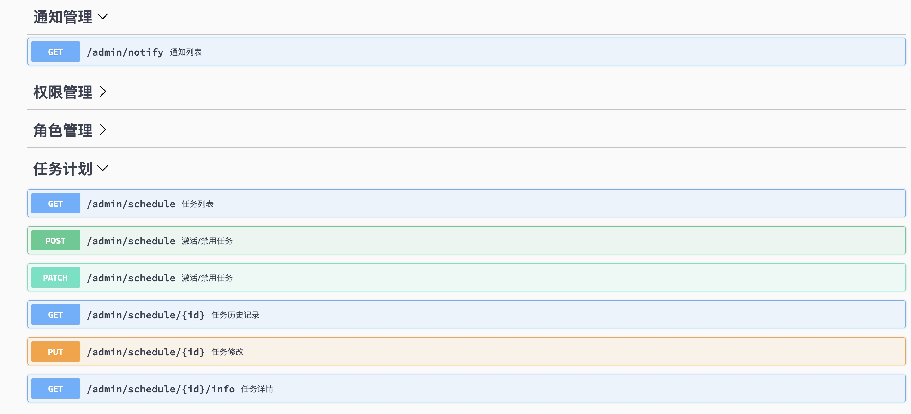

<h1 align="center">Golang Spug</h1>

## 环境

* go 1.13.5+
* Node 12.14
* React 16.11

## 特性

```
这个项目是一个学习go的运维管理项目， 基于gin封装的后台，基于react提供的前端。

实现了已下基本功能：
  用户管理
  权限管理
  角色授权
  发布部署
  在线终端
  域名管理
  证书管理
  任务计划
  通知提醒
  swagger

该项目实行的时候参考了 https://github.com/openspug/spug 
目前已经满足基本的运维发布平台需求，还有很多功能需要完善，望共勉。

发布回滚 websock 返回数据更加友好优化。
增加多种后端类型的发布方式
三级/多级审核
通知支持更友好化，包括支持企业微信通知等
支持openven（基于mysql认证）用户的增删改查
```
## Change Log
```
v1.2
增加平台消息通知
增加钉钉消息通知
增加定时任务功能
增加系统定时任务 
  域名证书检测 
  任务失效性检查

v1.1
第一个版本
```
## 安装
### 前端

```
// 参考链接
https://ant.design/docs/react/introduce-cn

// 安装依赖
npm install

// 开发环境
umi dev
```
### 前端线上部署 
```
1）在项目前端的根目录下，执行
umi build

2) 把 dist 目录同步到线上机器需要部署的位置

3） 使用Nginx做部署， 配置文件如下。
做了来源访问限制。
```
```
# cat /etc/nginx/conf.d/omp.zhien88.com.conf
map $http_upgrade $connection_upgrade {
    default upgrade;
    '' close;
}


upstream omp {
    server 127.0.0.1:9090;
}

server {
    server_name omp.zhien88.com;
    listen 3000;
    gzip on;
    gzip_min_length 1k;
    gzip_comp_level 9;
    gzip_types text/plain application/javascript application/x-javascript text/css application/xml text/javascript application/x-httpd-php image/jpeg image/gif image/png;
    gzip_vary on;
    gzip_disable "MSIE [1-6]\.";
    #include /etc/nginx/ssl-params.conf;

    root /data/omp/web/dist;

    location @fallback {
        rewrite .* /index.html break;
    }

    location / {
        allow 10.0.0.0/8;
        allow 127.0.0.1;
        deny all;
        try_files $uri @fallback;
        autoindex on;
    }


    location /swagger/ {
        allow 10.0.0.0/8;
        allow 127.0.0.1;
        deny all;
        proxy_pass http://omp;
        proxy_read_timeout 300s;
        proxy_send_timeout 300s;

        proxy_set_header Host $host;
        proxy_set_header X-Real-IP $remote_addr;
        proxy_set_header X-Forwarded-For $proxy_add_x_forwarded_for;

        proxy_http_version 1.1;
        proxy_set_header Upgrade $http_upgrade;
        proxy_set_header Connection $connection_upgrade;
        client_max_body_size    100m;
    }

    location /admin/ {
        allow 10.0.0.0/8;
        allow 127.0.0.1;
        deny all;
        proxy_pass http://omp;
        proxy_read_timeout 300s;
        proxy_send_timeout 300s;

        proxy_set_header Host $host;
        proxy_set_header X-Real-IP $remote_addr;
        proxy_set_header X-Forwarded-For $proxy_add_x_forwarded_for;

        proxy_http_version 1.1;
        proxy_set_header Upgrade $http_upgrade;
        proxy_set_header Connection $connection_upgrade;
        client_max_body_size    100m;
    }
}
```
### 后端

```
1, 需要手动创建表结构
请预先创建好编码为utf8mb4的数据库，如 admin-go-api
导入基本表结构，文件在 files/admin-go-api.sql

2, 添加管理员
go run manage.go -c create_admin

3, 运行后台项目
go build main.go
```

### 后端线上部署
```
1) 打包成 linux 平台的二进制包 
CGO_ENABLED=0 GOOS=linux GOARCH=amd64 go build  main.go


2）copy 依赖目录和文件到部署机器的相应目录
[root@monitor ~]# cd /data/omp/api
[root@monitor api]# ll
总用量 44832
drwxr-xr-x 2 root root      4096 6月   6 15:20 conf
drwxr-xr-x 2 root root      4096 5月  11 17:49 docs
drwxr-xr-x 3 root root      4096 5月  11 17:49 files
-rwxr-xr-x 1  501 games 45879616 6月   6 23:15 main
-rw-r--r-- 1 root root      1807 5月  11 17:49 manage.go
drwxr-xr-x 6 root root      4096 6月   6 15:18 runtime
drwxr-xr-x 2 root root      4096 6月   5 20:33 templates


3）systemd  启动配置

[root@monitor api]# cat /etc/systemd/system/ompapi.service
[Unit]
Description=ompapi
After=network.target

[Service]
Type=simple
WorkingDirectory=/data/omp/api
ExecStart=/data/omp/api/main
RestartSec=10s
Restart=on-failure
UMask=0007

[Install]
WantedBy=multi-user.target

4) 启动和开机自启动
略
```
## 后端目录介绍

```
conf        // 配置目录
docs        // swagger文档目录
controller  // 主应用目录
main.go     // 入口程序
manage.go   // 初始化和启用管理用户的工具程序
middleware  // gin中间件
models      // 存储层接口
pkg         // 公共模块
routers     // 路由设置
runtime     // 运行生成的目录
templates   // 视图模板文件
files       // 系统运行或者初始化依赖文件
```

## 预览





