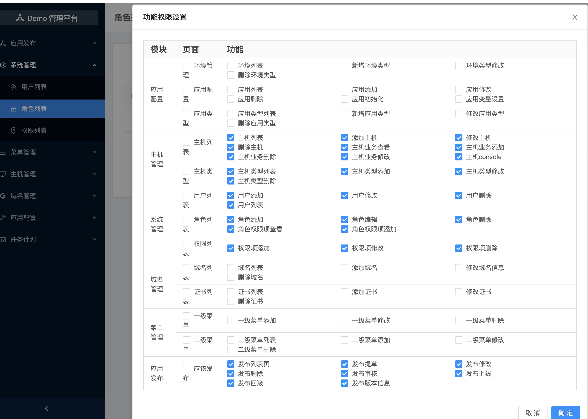
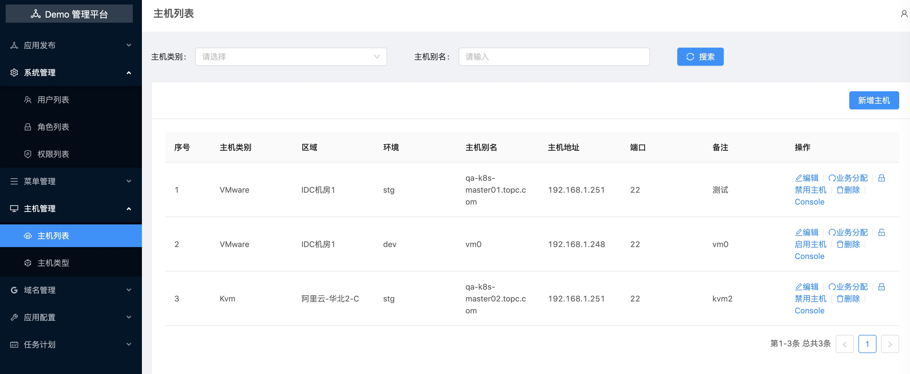
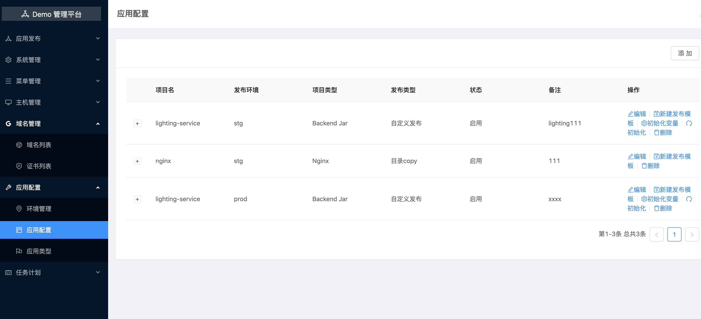
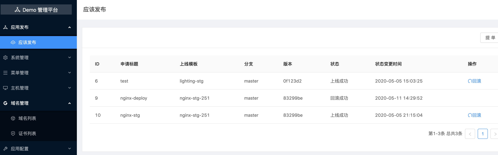
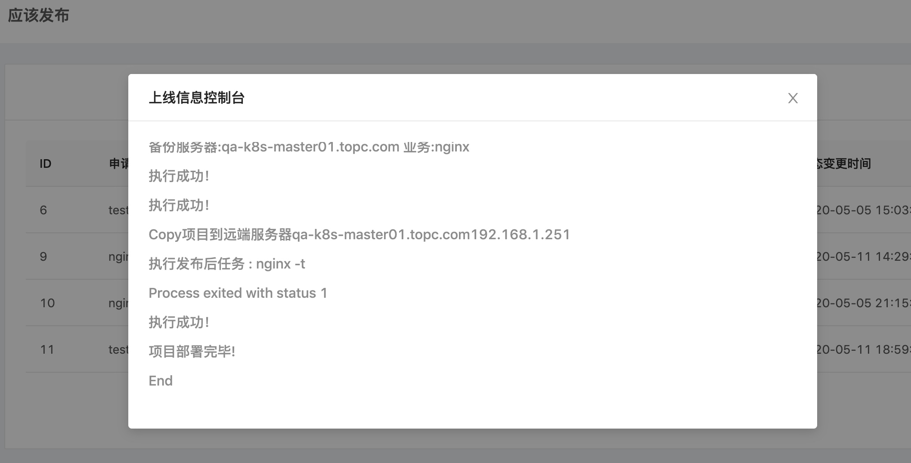
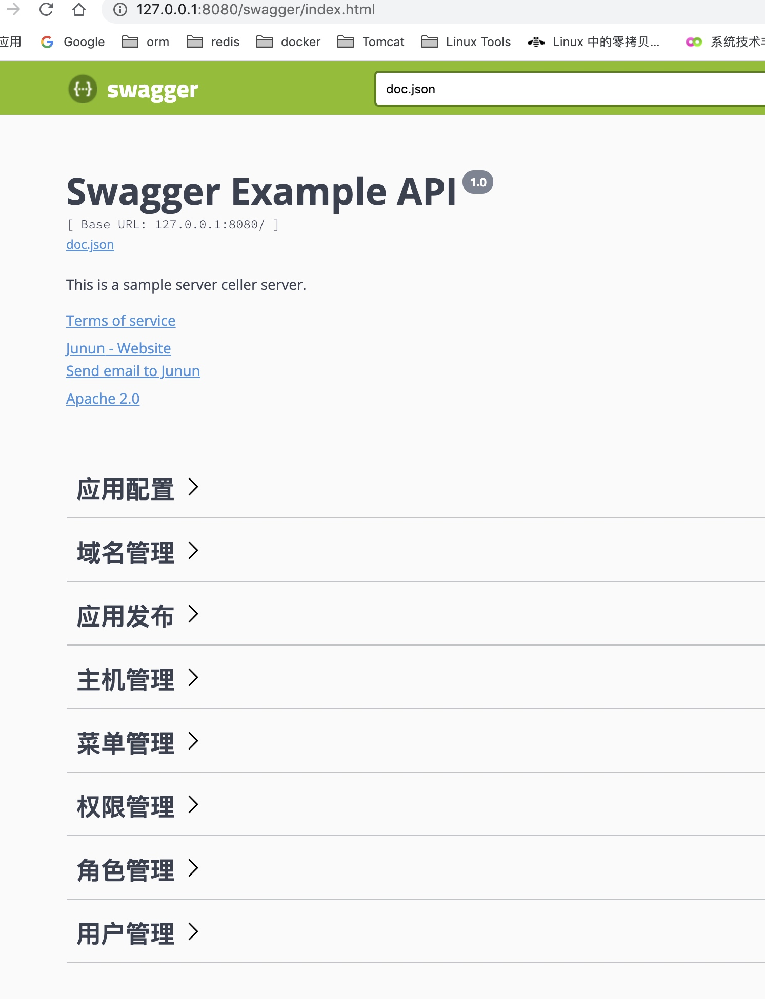

<h1 align="center">Golang Spug</h1>

<div align="center">


## 环境

* go 1.13.5+
* Node 12.14
* React 16.11

## 特性

```
这个项目是一个学习go的练手项目， 基于gin封装的后台，基于react提供的前端。

实现了已下基本功能：
  用户管理
  权限管理
  角色授权
  发布部署
  在线终端
  域名管理
  证书管理
  swagger

该项目实行的时候参考了 https://github.com/openspug/spug 
目前已经满足基本的运维发布平台需求，还有很多功能需要完善，望共勉。

后期任务做任务计划功能。
发布回滚 websock 返回数据更加友好优化。
```
## 安装
### 前端

```
// 参考链接
https://ant.design/docs/react/introduce-cn

// 安装依赖
npm install

// 开发环境
umi dev
```
### 后端

```
1, 需要手动创建表结构
请预先创建好编码为utf8mb4的数据库，如 admin-go-api
导入基本表结构，文件在 files/admin-go-api.sql

2, 添加管理员
go run manage.go -c create_admin

3, 运行后台项目
go build main.go
```


## 后端目录介绍

```
conf        // 配置目录
docs        // swagger文档目录
controller  // 主应用目录
main.go     // 入口程序
manage.go   // 初始化和启用管理用户的工具程序
middleware  // gin中间件
models      // 存储层接口
pkg         // 公共模块
routers     // 路由设置
runtime     // 运行生成的目录
templates   // 视图模板文件
files       // 系统运行或者初始化依赖文件
```

## 预览















